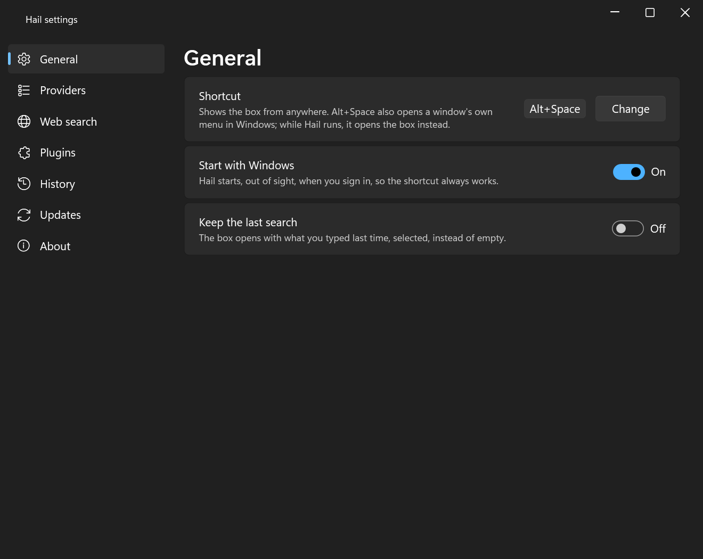
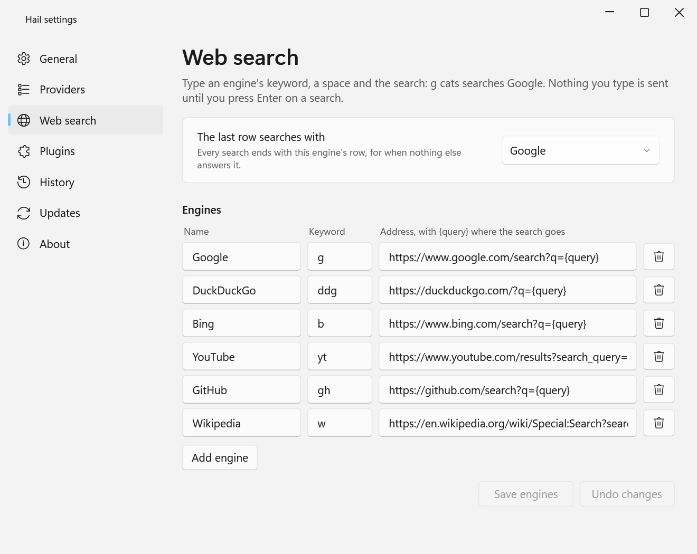

# Hail

A keyboard launcher for Windows. Press **Alt+Space**, type, press **Enter**: an app starts, a
file opens, a sum is answered, a search goes to the browser, and the box is gone.

Everything Hail finds comes from a provider, and the built-in ones are written against the
same plugin contract (`Hail.Sdk`, MIT) a stranger would use.

## Download

**[Hail-Setup.exe](https://github.com/HendrikVrey/Hail/releases/latest/download/Hail-Setup.exe)**,
the newest release, for Windows 10 (1809) and 11 on x64 or Arm64. It installs for you alone,
asks for no administrator rights, and offers to start Hail when you sign in.

The installer is not signed, so SmartScreen will say it does not recognise it: choose **More
info**, then **Run anyway**. (Until the first version is released, that link finds nothing;
the newest build of `master` below is there from the first push.)
[The newest build of `master`](https://github.com/HendrikVrey/Hail/releases/download/latest/Hail-Setup.exe)
is there too, rebuilt on every change, for trying what is not released yet.

Uninstalling (Settings, Apps) quits Hail first and removes its start at sign-in. Your settings,
history and plugins stay in `%LOCALAPPDATA%\Hail` until you delete that folder.

## What it does

- Lives in the notification area. **Alt+Space** shows the box on the monitor under the mouse;
  Alt+Space again, **Escape**, or clicking elsewhere hides it.
- **Apps**: everything the Start menu lists, desktop and Microsoft Store apps alike. `note`
  finds Notepad, `ps` finds PowerShell, `code studio` finds Visual Studio Code. The matched
  letters are in bold.
- **Files** by name, from the Windows Search index: only the folders Windows is told to index
  (by default your own). Type a path (`C:\Users\`, `~\Doc`) to list a folder instead; **Tab**
  completes the highlighted entry. Network paths and mapped network drives are neither listed
  nor opened: each keystroke would reach the server.
- **Sums** as you type: `15% of 240`, `2^10`, `sqrt(2)`, `2pi`, `0xFF + 1`. Start with `=` to
  force it. Your region's decimal separator works (`0,1 + 0,2`), and so does the point.
- **Web search**: a keyword and a space pick the engine (`g`, `ddg`, `b`, `yt`, `gh`, `w`). The
  keyword leaves the box and the engine's name sits beside it, so `g cats` reads *Google* `cats`;
  Backspace at the start of the box takes it away. Every box ends with *Search Google for ...*
  when nothing else answered it better.
- **Commands**: Lock, Sleep, Sign out, Restart, Shut down, Hail settings, Quit Hail. Anything
  that can cost unsaved work asks first, in the box.
- **History**: what you pick is favoured the next time you type the same start, and an empty
  box shows what you pick most.
- **Plugins**: each one a folder in `%LOCALAPPDATA%\Hail\plugins\`. Hail asks before it runs
  one, and asks again if its files change. See *Plugins* below.

### Keys

| Key | Does |
|---|---|
| Up / Down, Ctrl+K / Ctrl+J | Move the highlight |
| Enter | The highlighted row's action (named on the row) |
| Ctrl+Enter, Shift+Enter, Ctrl+Shift+Enter | Other actions, listed under the rows |
| Ctrl+C | Copy the highlighted file's path (or the box's selected text) |
| Ctrl+Shift+C | Copy the highlighted file itself |
| Tab | Complete a path or a sum into the box |
| Backspace, at the start | Take away the engine (or calculator) beside the box |
| Ctrl+, | Open Hail's settings |
| Escape | Go back from a question, or hide the box |

Results that arrive late never move the highlighted row, so Enter always runs the row you
were looking at.

### The tray

Click the icon to open the box. Right-click it for **Settings**, **Plugins** and **Quit Hail**.
A provider Hail had to switch off (one that kept failing) is named there too.

If another program already holds Alt+Space (PowerToys Run does by default), Hail still starts
and says so in a notification; click the notification to choose another shortcut, or the tray
icon to open the box.

## Settings

**Settings** in the tray, **Ctrl+,** in the box, or `hail settings` typed into it. Every change
counts at once; nothing needs a restart.



- **General**: the shortcut (press **Change**, then the new keys: Ctrl, Alt or Win with a
  letter, a digit, Space or a function key), **Start with Windows**, and **Keep the last search**.
- **Providers**: switch any of the built-in five off, and see the keyword that asks each alone.
- **Web search**: the engines, their keywords and addresses, and which one ends every search.
  An address must be `https` with `{query}` in its path or query string, and is checked when you
  save, not when you search.
- **Plugins**, **History** (and **Clear history**), **Updates**, **About**.



Everything is kept in `%LOCALAPPDATA%\Hail\settings.json`, which can also be edited by hand
while Hail is not running. A value Hail cannot use falls back to its default alone, and the
log says which.

```json
{
  "hotkey": "Alt+Space",
  "keepLastQuery": false,
  "webSearch": {
    "defaultEngine": "g",
    "engines": [ { "keyword": "g", "name": "Google", "template": "https://www.google.com/search?q={query}" } ]
  },
  "disabledProviders": [ "hail.files" ],
  "checkForUpdates": true
}
```

The providers are `hail.apps`, `hail.calculator`, `hail.files`, `hail.commands` and `hail.web`.

## Updates

Hail asks once, shortly after it first starts, whether it may check for new versions. Until
you say yes, it sends nothing. With checks on, it asks GitHub once a day, when it starts or when
you open the box, never on a timer. The request carries Hail's version and nothing else.

A new version is a notification; click it, then **Update**, **Later** or **Skip this version**.
The installer is checked against the checksum GitHub publishes, as it downloads and again just
before it runs, then Hail quits so it can be replaced and starts again when the installer
finishes. **Check now** in Settings, Updates asks at any time.

## Plugins

A plugin adds results to the box. It is a folder under `%LOCALAPPDATA%\Hail\plugins\`, named
after the plugin, holding its `plugin.json` and its assemblies. To install one, copy its folder
there and choose **Plugins**, **Reload plugins** in the tray (or type `reload plugins`).

**Nothing in a plugin's folder runs until you say so.** Hail finds the new folder, tells you,
and asks, showing the plugin's name, who it says it is from, which searches it joins and where
it lives. It remembers your answer for exactly those files: if any file in the folder changes,
the plugin is off until you answer again. A plugin is a program that runs as you, so enable
only the ones you would install as programs.

**Settings**, **Plugins** (or the tray's **Plugins** menu) lists each plugin with where it
stands, and offers **Enable...**, **Switch off** and **Settings...** (a form drawn from what the plugin declares; a token or
password there is kept encrypted for your Windows account). **Reload plugins** unloads them all
and reads the folder again, so a plugin author can rebuild without restarting Hail.

**Everything** (`plugins/Hail.Plugin.Everything`, MIT) is the first plugin: `e report` finds
every file named like *report* on every drive, through
[Everything](https://www.voidtools.com/) by voidtools, which must be installed and running.
Build it and copy it in:

```
dotnet build plugins/Hail.Plugin.Everything -c Release -p:HailDeploy=true
```

**Writing one**: `docs/plugins.md` goes from an empty folder to a result on screen, and
`dotnet new install templates/hail-plugin` gives you a project that builds straight into the
plugins folder.

## Privacy

Nothing you type leaves your machine until you press Enter on a web search. Hail fetches no
suggestions and sends no telemetry. The one request Hail makes by itself is the update check,
and only once you have allowed it.

These are written to `%LOCALAPPDATA%\Hail`:

- **One log a day** (`logs`, thirty kept), which records what Hail did and never what you typed.
- **History** (`usage.json`): the apps, files and commands you picked, and the first 16
  characters of what you had typed when you picked each. Sums and web searches are never
  recorded. **Clear history** in Settings, History empties it.
- **The update check** (`update.json`): when it last asked, and a version you chose to skip.
- **Your answers about plugins** (`plugins.json`) and **plugins' settings**
  (`plugin-settings.json`, with secrets encrypted for your Windows account), and each plugin's
  own `data` folder if it keeps one.

A plugin is not held to Hail's promises: it can do whatever a program running as you can.

## Build and run

Needs the .NET 10 SDK on Windows 10 or 11.

```
dotnet build Hail.slnx
dotnet test Hail.slnx
dotnet run --project src/Hail.App
```

The plugin contract packs on its own (`dotnet pack src/Hail.Sdk -c Release`); nothing else in
the solution is a package.

The installer is built as the release workflow builds it, with
[Inno Setup 6](https://jrsoftware.org/isinfo.php):

```
dotnet publish src/Hail.App -c Release -r win-x64 --self-contained true -o publish/win-x64
dotnet publish src/Hail.App -c Release -r win-arm64 --self-contained true -o publish/win-arm64
iscc installer\Hail.iss
```

Every push to `master` rebuilds the rolling installer; a `v*` tag makes a draft release.

The icon is drawn from geometry by `python assets/build-icon.py` (Pillow).

## Layout

| Project | What it holds |
|---|---|
| `Hail.Sdk` | The plugin contract. No dependencies, no UI types. **MIT**, see `src/Hail.Sdk/LICENSE`. |
| `Hail.Core` | Pure: the supervisor, keyword parsing, the fuzzy matcher, ranking and history, the no-jump list, the Windows Search SQL. |
| `Hail.Providers` | The built-in providers (apps, files, calculator, web search, commands), written against `Hail.Sdk` and host ports only. |
| `Hail.Windows` | Every Win32, COM and OLE DB call: the hotkey, the Start menu, icons, the index, launching, session commands, the Run key, the tray, and starting a downloaded installer. |
| `Hail.Updates` | The one request Hail makes itself: asking GitHub for the newest release and downloading it. |
| `Hail.Persistence` | The log, the settings file, history, plugin answers and plugin settings, written atomically. |
| `Hail.Plugins` | Finding plugins, fingerprinting their files, loading each into a collectible context of its own, and unloading it. |
| `Hail.App` | The box, the tray, the settings window, and the plugin question and settings form (WPF + WPF UI). |
| `plugins/Hail.Plugin.Everything` | The Everything plugin, built against `Hail.Sdk` alone. |
| `templates/hail-plugin` | The `dotnet new hail-plugin` template. |

`ArchitectureTests` hold each project to its line.

## Licence

Hail is source-available, not open source: free to use, including at work, but not to modify
or redistribute. See `LICENSE`. The plugin contract in `src/Hail.Sdk`, the template in
`templates/hail-plugin`, the guide in `docs/plugins.md` and the Everything plugin in
`plugins/Hail.Plugin.Everything` are the exception and are MIT licensed, so plugins can be
written and published under any terms.
